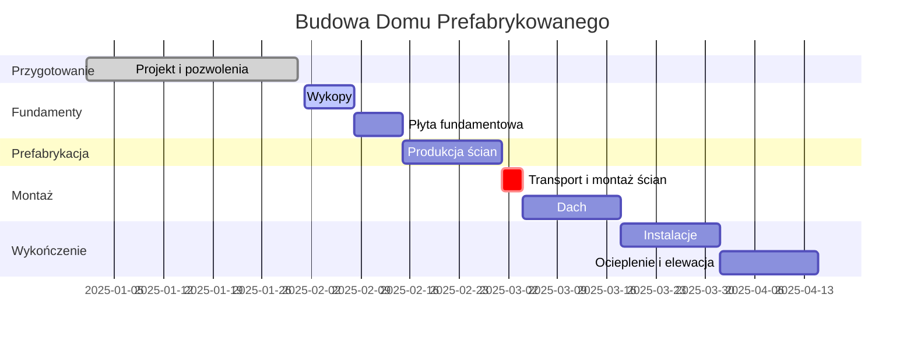

# 🏠 Domki Marysia - Domy Prefabrykowane z Keramzytu i Drewna

[](https://domkimarysia.com)
[](https://domkimarysia.com)
[](https://domkimarysia.com)
[](https://domkimarysia.com)

## 🎯 Kim jesteśmy?

**Domki Marysia** to polski producent domów prefabrykowanych, specjalizujący się w technologii **keramzytobetonowej** oraz **drewnianej**. Budujemy domy w rekordowym czasie 6-12 tygodni, dostarczając gotowe prefabrykaty bezpośrednio na Twoją działkę.

### 🏆 Dlaczego my?
- ✅ **15+ lat doświadczenia** w prefabrykacji
- ✅ **300+ zrealizowanych domów** w całej Polsce
- ✅ **AI Architekt** - innowacyjny doradca online
- ✅ **Gwarancja 50 lat** na konstrukcję
- ✅ **Stała cena** - bez ukrytych kosztów

---

## 💰 Cennik 2025 - Domy Prefabrykowane

### 🧱 Domy z Keramzytu

| Model | m² | Cena od* | Czas budowy | Zobacz |
|-------|----|----------|-------------|--------|
| **COMPACT KEO** | 50-70 | 294,000 zł | 6 tyg. | [→ Szczegóły](https://domkimarysia.com) |
| **COMFORT KEO** | 80-100 | 420,000 zł | 8 tyg. | [→ Szczegóły](https://domkimarysia.com) |
| **PREMIUM KEO** | 120-150 | 630,000 zł | 10 tyg. | [→ Szczegóły](https://domkimarysia.com) |
| **VILLA KEO** | 180-200 | 840,000 zł | 12 tyg. | [→ Szczegóły](https://domkimarysia.com) |

### 🌲 Domy Drewniane

| Model | m² | Cena od* | Czas budowy | Zobacz |
|-------|----|----------|-------------|--------|
| **ECO WOOD** | 60-80 | 285,000 zł | 5 tyg. | [→ Szczegóły](https://domkimarysia.com) |
| **NORDIC STYLE** | 90-110 | 415,000 zł | 7 tyg. | [→ Szczegóły](https://domkimarysia.com) |
| **SCANDI PREMIUM** | 120-140 | 560,000 zł | 9 tyg. | [→ Szczegóły](https://domkimarysia.com) |
| **LOG HOUSE** | 150-180 | 720,000 zł | 11 tyg. | [→ Szczegóły](https://domkimarysia.com) |

*Cena zawiera: projekt, fundamenty, montaż, stan deweloperski

---

## 🤖 AI Architekt - Rewolucja w Planowaniu

### Pierwszy w Polsce AI Doradca Budowlany!

Nasz **AI Architekt** pomoże Ci:
- 🎯 Dobrać idealną technologię (keramzyt vs drewno)
- 💵 Precyzyjnie wyliczyć koszty
- 📐 Zaplanować rozkład pomieszczeń
- 📋 Przygotować checklist dokumentów
- ❓ Odpowiedzieć na 1000+ pytań

**[🤖 POROZMAWIAJ Z AI ARCHITEKTEM →](https://domkimarysia.com)**

---

## 🏗️ Technologie Budowlane

### KERAMZYT - Forteca Trwałości

#### ✅ Zalety:
- 🔥 **Niepalność** - klasa A1, pełne bezpieczeństwo
- 🐭 **Odporność na szkodniki** - gryzonie i owady omijają
- 🌡️ **Akumulacja ciepła** - stała temperatura w domu
- 🔇 **Cisza** - izolacja akustyczna 55dB
- ⏳ **300 lat trwałości** - inwestycja na pokolenia

#### ❌ Wady:
- Wyższy koszt początkowy (+10-15%)
- Wymaga dźwigu przy montażu
- Cięższy transport

#### 📊 Parametry techniczne:
```
Współczynnik U: 0,15 W/m²K
Ogniotrwałość: REI 240
Akustyka: Rw = 55 dB
Grubość ściany: 15-24 cm + 20 cm styropian
Wytrzymałość: 15 MPa
```

---

### DREWNO - Naturalny Komfort

#### ✅ Zalety:
- 🌿 **100% ekologia** - naturalny materiał
- 💨 **Lekka konstrukcja** - łatwiejszy transport
- 🏡 **Przytulny klimat** - naturalna regulacja wilgoci
- 🔨 **Elastyczność** - łatwe modyfikacje
- 💰 **Niższa cena** początkowa

#### ❌ Wady:
- Wymaga konserwacji co 5-10 lat
- Wrażliwość na wilgoć
- Klasa palności (impregnacja)

#### 📊 Parametry techniczne:
```
Współczynnik U: 0,18 W/m²K
Konstrukcja: drewno C24
Izolacja: wełna mineralna 20 cm
Paroizolacja: folia PE
Żywotność: 100+ lat (przy konserwacji)
```

---

## 📅 Harmonogram Budowy - 12 Tygodni MAX!


---

## 📍 Nasze Realizacje 2024/2025

### 🏆 Wybrane Projekty:

#### Dom w Warszawie (Keramzyt, 120m²)
- 👨‍👩‍👧‍👦 Rodzina 4-osobowa
- ⏱️ Czas budowy: **8 tygodni**
- 💰 Koszt: 485,000 zł
- ⭐ Smart Home Ready

#### Willa pod Krakowem (Keramzyt, 180m²)
- 🏢 Dom dwurodzinny
- ⏱️ Czas budowy: **10 tygodni**
- 💰 Koszt: 720,000 zł
- ⭐ Basen i garaż

#### Dom na Mazurach (Drewno, 90m²)
- 🏖️ Dom wakacyjny całoroczny
- ⏱️ Czas budowy: **6 tygodni**
- 💰 Koszt: 340,000 zł
- ⭐ Taras 40m²

---

## ❓ FAQ - Najczęściej Zadawane Pytania

<details>
<summary><b>🌨️ Czy można budować zimą?</b></summary>

TAK! Prefabrykaty montujemy przez cały rok. Elementy produkowane są w hali, więc deszcz czy śnieg nie wpływa na jakość. Montaż możliwy do -5°C.
</details>

<details>
<summary><b>📄 Jakie dokumenty są potrzebne?</b></summary>

- Pozwolenie na budowę (pomożemy załatwić)
- Projekt budowlany (dostarczamy)
- Wypis z miejscowego planu
- Mapa do celów projektowych
- Warunki zabudowy (jeśli brak planu)
</details>

<details>
<summary><b>💰 Czy cena może wzrosnąć w trakcie budowy?</b></summary>

NIE! Podpisujemy umowę na stałą kwotę. Jedyne dodatkowe koszty mogą wynikać ze zmian wprowadzanych przez klienta.
</details>

<details>
<summary><b>🏗️ Czy mogę sam wykonać wykończenie?</b></summary>

TAK! Oferujemy różne stany wykończenia:
- Stan surowy zamknięty
- Stan deweloperski
- Stan pod klucz
</details>

<details>
<summary><b>🚚 Czy działka musi mieć specjalny dojazd?</b></summary>

Potrzebujemy dojazdu dla:
- TIR-a z prefabrykatami (dł. 16m)
- Dźwigu (rozstaw podpór 5x5m)
- Szerokość drogi min. 3,5m
</details>

---

## 🛠️ Proces Współpracy

### 1️⃣ **Konsultacja** (GRATIS)
- Rozmowa z doradcą lub AI Architektem
- Analiza potrzeb i możliwości
- Wstępna wycena

### 2️⃣ **Projekt** (7-14 dni)
- Wybór z katalogu lub projekt indywidualny
- Adaptacja do działki
- Kosztorys szczegółowy

### 3️⃣ **Umowa** (1 dzień)
- Stała cena
- Harmonogram
- Gwarancje

### 4️⃣ **Produkcja** (14-21 dni)
- Prefabrykacja w hali
- Kontrola jakości
- Przygotowanie transportu

### 5️⃣ **Montaż** (3-5 dni)
- Transport na działkę
- Montaż dźwigiem
- Połączenie elementów

### 6️⃣ **Wykończenie** (4-8 tygodni)
- Dach i instalacje
- Ocieplenie
- Elewacja

---

## 📊 Porównanie z Tradycyjną Budową

| Kryterium | Prefabrykaty | Tradycyjna | Oszczędność |
|-----------|--------------|------------|-------------|
| **Czas budowy** | 3 miesiące | 24 miesiące | **21 miesięcy!** |
| **Koszt robocizny** | 50,000 zł | 150,000 zł | **100,000 zł** |
| **Straty materiału** | 2% | 15% | **13%** |
| **Koszty ogrzewania placu** | 0 zł | 20,000 zł | **20,000 zł** |
| **Błędy wykonawcze** | 0.5% | 10% | **9.5%** |
| **SUMA OSZCZĘDNOŚCI** | - | - | **~150,000 zł** |

---

## 🏅 Certyfikaty i Gwarancje

### Nasze Certyfikaty:
- ✅ **ISO 9001:2015** - System Zarządzania Jakością
- ✅ **CE** - Zgodność z normami EU
- ✅ **ITB** - Aprobata Techniczna
- ✅ **FSC** - Drewno z zarządzanych lasów

### Gwarancje:
- 🏗️ **50 lat** - konstrukcja nośna
- 🏠 **30 lat** - pokrycie dachowe  
- 🪟 **5 lat** - stolarka okienna i drzwiowa
- ⚡ **5 lat** - instalacje elektryczne
- 💧 **5 lat** - instalacje wod-kan

---

## 🗺️ Działamy w Całej Polsce!

### Województwa gdzie budujemy:

**Centrum:**
- ✅ Mazowieckie (Warszawa)
- ✅ Łódzkie (Łódź)

**Południe:**
- ✅ Małopolskie (Kraków)
- ✅ Śląskie (Katowice)
- ✅ Podkarpackie (Rzeszów)
- ✅ Świętokrzyskie (Kielce)

**Zachód:**
- ✅ Wielkopolskie (Poznań)
- ✅ Dolnośląskie (Wrocław)
- ✅ Lubuskie (Zielona Góra)
- ✅ Opolskie (Opole)

**Północ:**
- ✅ Pomorskie (Gdańsk)
- ✅ Zachodniopomorskie (Szczecin)
- ✅ Kujawsko-Pomorskie (Bydgoszcz)
- ✅ Warmińsko-Mazurskie (Olsztyn)

**Wschód:**
- ✅ Lubelskie (Lublin)
- ✅ Podlaskie (Białystok)

---

## 📞 Kontakt

### **DOMKI MARYSIA**
*Twój Partner w Budowie Domu Prefabrykowanego*

- 🌐 **Strona:** [www.domkimarysia.com](https://domkimarysia.com)
- 📧 **Email:** kontakt@domkimarysia.com
- 📱 **Telefon:** +48 XXX XXX XXX
- 🏢 **Biuro:** [Adres biura]
- 🏭 **Fabryka:** [Adres fabryki]

### **Godziny otwarcia:**
```
Poniedziałek - Piątek: 8:00 - 18:00
Sobota: 9:00 - 14:00
Niedziela: AI Architekt 24/7
```

---

## 🎁 Promocje 2025

### 🔥 **OFERTA SPECJALNA - ZIMA 2025**

Przy zamówieniu do końca lutego:
- 📉 **-5%** rabatu na całość
- 🎁 **GRATIS** projekt indywidualny (wartość 15,000 zł)
- 🚗 **GRATIS** podjazd z kostki (do 50m²)
- 🌡️ **GRATIS** pompa ciepła

**[SKORZYSTAJ Z PROMOCJI →](https://domkimarysia.com/pages/zamow-wycene-indywidualna-prefabrykowanego-domu)**

---

## 📚 Materiały do Pobrania

- 📄 [Katalog Domów 2025 (PDF)](https://domkimarysia.com)
- 📊 [Cennik Szczegółowy (Excel)](https://domkimarysia.com)
- 🎨 [Wizualizacje 3D](https://domkimarysia.com)
- 📋 [Specyfikacja Techniczna](https://domkimarysia.com)
- 📝 [Wzór Umowy](https://domkimarysia.com)

---

## 🌟 Opinie Klientów

> ⭐⭐⭐⭐⭐ **"W 8 tygodni mieliśmy gotowy dom!"**
> *Niesamowite tempo i jakość. Rodzina Kowalskich, Warszawa*

> ⭐⭐⭐⭐⭐ **"AI Architekt to strzał w dziesiątkę"**
> *Pomógł nam wybrać idealny projekt. Państwo Nowakowie, Kraków*

> ⭐⭐⭐⭐⭐ **"Keramzyt = cisza i ciepło"**
> *Rachunki za ogrzewanie spadły o 60%! Pan Andrzej, Gdańsk*

---

## 🔗 Zobacz Także

### Nasze inne repozytoria:
- [keramzyt-technologia](https://github.com/dorota-sketch/keramzyt-technologia)
- [kalkulator-kosztow-budowy](https://github.com/dorota-sketch/kalkulator-kosztow)
- [ai-architekt-prompts](https://github.com/dorota-sketch/ai-architekt)
- [projekty-domow-2025](https://github.com/dorota-sketch/projekty-domow)

### Partnerzy:
- 🏦 Kredyty budowlane - PKO BP
- ⚡ Instalacje fotowoltaiczne - SolarTech
- 🌡️ Pompy ciepła - Vaillant
- 🏡 Projekty wnętrz - Studio Marysia

---

*© 2025 Domki Marysia. Wszystkie prawa zastrzeżone.*

*Ostatnia aktualizacja: Październik 2025 | Wersja: 2.0*

---

**⚡ Zbuduj z nami swój wymarzony dom w 12 tygodni!**

**[🏠 ZAMÓW BEZPŁATNĄ WYCENĘ](https://domkimarysia.com/pages/zamow-wycene-indywidualna-prefabrykowanego-domu)**
